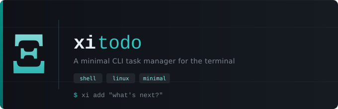

<div align="center">



<br>

&nbsp;
&nbsp;
&nbsp;
&nbsp;
[](https://github.com/3rr0r-505/Xi/actions/workflows/go.yml)&nbsp;
[](https://github.com/3rr0r-505/Xi/actions/workflows/go.yml)


**A minimal, hash-addressed CLI task manager written in Go.**
No databases. No dependencies. Just a flat JSON file and your terminal.

</div>

---

## Overview

`xi` is a command-line task manager built with Go, focusing on clean architecture, idiomatic Go patterns, and zero external dependencies.

Tasks are identified using SHA-1 hash prefixes and stored in a flat JSON structure at `~/.xi/tasks.json`. All interactions are performed directly through the terminal.

---

## Features

* Task lifecycle: add, complete, delete, and reprioritise
* Subtask support using parent–child relationships via hash IDs
* Flexible filtering by status and completion date
* Detailed task inspection with hierarchical subtask view
* SHA-1 based addressing with short prefix resolution
* Zero external dependencies — pure Go standard library

---

## Installation

**Prerequisites:** Go 1.24 or later

```bash
go install github.com/3rr0r-505/Xi/cmd/xi@latest
```

Make sure `~/go/bin` is in your `$PATH`:

```bash
echo 'export PATH=$PATH:$HOME/go/bin' >> ~/.zshrc && source ~/.zshrc
```

Verify:

```bash
xi --help
```

**Manual build:**

```bash
git clone https://github.com/3rr0r-505/Xi.git
cd Xi
go build -o bin/xi ./cmd/xi/
chmod 755 bin/xi
cp bin/xi ~/.local/bin/
```

---

## Usage

```
xi <subcommand> [flags]
```

| Subcommand                         | Description                    |
| ---------------------------------- | ------------------------------ |
| `add <desc>`                       | Add a new task                 |
| `done <id>`                        | Mark a task as done            |
| `pending <id>`                     | Mark a task as pending         |
| `delete <id>`                      | Delete a task and its subtasks |
| `details <id>`                     | Show detailed task view        |
| `add-subtask <id> <desc>`          | Add a subtask                  |
| `prioritise <id>`                  | Toggle task priority           |
| `list`                             | List all tasks                 |
| `list --done`                      | List completed tasks           |
| `list --pending`                   | List pending tasks             |
| `list --completed-on <YYYY-MM-DD>` | Filter by completion date      |

Task IDs are SHA-1 hashes; use the first 6+ characters as a prefix:

```bash
xi add "Read Keith Ross Chapter 1"
# ✔ Task added [f8b2cd]

xi list
#   #    ID        Title                           Status       SubTasks  Priority
#   ───────────────────────────────────────────────────────────────────────────────
#   1    f8b2cd    Read Keith Ross Chapter 1       pending      0

xi done f8b2cd
# ✔ Status updated for task [f8b2cd]

xi add-subtask f8b2cd "Chapter 1 exercises"
# ✔ Subtask added [a3c219]

xi details f8b2cd
#   [f8b2cd] Read Keith Ross Chapter 1
#   ───────────────────────────────────────────────
#   Status     : done
#   Created    : 2026-05-01 22:14:33
#   Completed  : 2026-05-01 22:15:10
#   Priority   : Low
#   SubTasks   : 1
#       ⤷ a3c219   Chapter 1 exercises   pending

xi delete f8b2cd
# ✔ Deleted task [f8b2cd]
```

---

## Data Format

Tasks are stored at:

```
~/.xi/tasks.json
```

Example structure:

```json
[
  {
    "id": "f8b2cd3a...",
    "parent_id": "",
    "title": "Read Keith Ross Chapter 1",
    "status": "done",
    "created_on": "2026-05-01T22:14:33Z",
    "completed_on": "2026-05-01T22:15:10Z",
    "prioritised": false
  },
  {
    "id": "a3c21988...",
    "parent_id": "f8b2cd3a...",
    "title": "Chapter 1 exercises",
    "status": "pending",
    "created_on": "2026-05-01T22:16:00Z",
    "prioritised": false
  }
]
```

* Top-level tasks have `"parent_id": ""`
* Subtasks reference their parent via `parent_id`
* Deletion cascades to all subtasks

---

## Testing and Benchmarks

```bash
# run all tests
go test ./...

# run specific package tests
go test -v ./internal/utils/

# run benchmarks
go test -bench=. ./internal/utils/
go test -bench=. ./internal/commands/
```

---

<div align="center">
<sub>Built in Go · No external dependencies · Made by 5pyd3r</sub>
</div>
